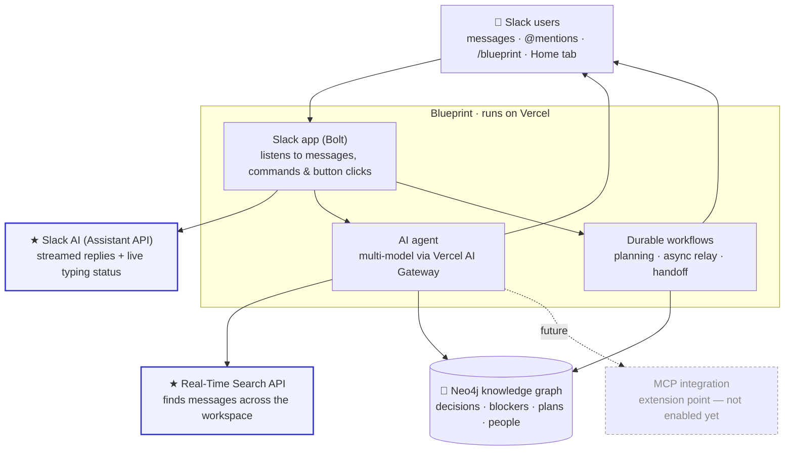

# 📐 Blueprint — the continuous cloud PM for Slack

[](<https://vercel.com/new/clone?demo-description=This%20is%20a%20Slack%20Agent%20template%20built%20with%20Bolt%20for%20JavaScript%20(TypeScript)%20and%20the%20Nitro%20server%20framework.&demo-image=%2F%2Fimages.ctfassets.net%2Fe5382hct74si%2FSs9t7RkKlPtProrbDhZFM%2F0d11b9095ecf84c87a68fbdef6f12ad1%2FFrame__1_.png&demo-title=Slack%20Agent%20Template&demo-url=https%3A%2F%2Fgithub.com%2Fvercel-partner-solutions%2Fslack-agent-template&env=SLACK_SIGNING_SECRET%2CSLACK_BOT_TOKEN&envDescription=These%20environment%20variables%20are%20required%20to%20deploy%20your%20Slack%20app%20to%20Vercel&envLink=https%3A%2F%2Fapi.slack.com%2Fapps&from=templates&project-name=Slack%20Agent%20Template&project-names=Comma%20separated%20list%20of%20project%20names%2Cto%20match%20the%20root-directories&repository-name=slack-agent-template&repository-url=https%3A%2F%2Fgithub.com%2Fvercel-partner-solutions%2Fslack-agent-template&root-directories=List%20of%20directory%20paths%20for%20the%20directories%20to%20clone%20into%20projects&skippable-integrations=1>)

A Slack Agent template built with [Workflow DevKit](https://useworkflow.dev)'s `DurableAgent`, [AI SDK](https://ai-sdk.dev) tools, [Bolt for JavaScript](https://tools.slack.dev/bolt-js/) (TypeScript), and the [Nitro](https://nitro.build) server framework.

---

## Inspiration

Every engineering team quietly leaks context. A decision gets made in a thread on Tuesday and forgotten by Friday. A PM drops a feature request with no owner, no scope, and no acceptance criteria. Someone in London is blocked overnight because the one person who understands the auth service is asleep in San Francisco. And two weeks later somebody reopens a debate the team already settled — because nobody remembered they'd settled it.

We didn't want another dashboard that people have to remember to update. We wanted a teammate that just *remembers* — one that lives where the work already happens (Slack), listens to the conversation, and steps in exactly when context is about to be lost. That teammate is **Blueprint: a continuous cloud PM.**

## What it does

Blueprint turns everyday Slack conversation into a living **knowledge graph**, then acts on it. On top of that memory it runs four autonomous agents plus a live dashboard:

- **🧠 Team memory** — classifies every channel message into a Neo4j graph of decisions, blockers, questions, topics, and who-knows-what. Ask `@Blueprint what did we decide about auth?` and it answers with sources.
- **⚠️ Decision Drift Detector** — when someone proposes something that *contradicts* a past decision, Blueprint flags it in-thread with the original decision and buttons to record a new direction or keep the old one.
- **📝 Context Gap Detector** — spots feature requests missing an owner, scope, acceptance criteria, or dependencies and asks for the gaps *before* engineering starts.
- **🗂️ Plan → Execute → Verify agent** — `@Blueprint break down <feature>` produces a graph-grounded plan (phases + owners drawn from the expertise graph + constraints from past decisions), waits for human approval, then autonomously follows up on progress.
- **🌙 Timezone Handoff + Async Relay** — hands off open work at the end of someone's local day, and if a question sits unanswered it either answers from memory or DMs the right expert at the start of *their* workday.
- **📐 Interactive App Home dashboard** — recent decisions, active blockers, plan progress, and trending topics — where you can resolve a blocker or check off a plan phase with one click.

## How we built it

- **Slack** — built on the Vercel Slack Agent template ([Bolt](https://tools.slack.dev/bolt-js/) + [Nitro](https://nitro.build)), using **Slack's Assistant (AI) API** for streamed replies and typing status, Block Kit for the interactive dashboard and cards, and the **Real-Time Search API** for recall across the workspace.
- **Durable agents** — [Workflow DevKit](https://useworkflow.dev) makes the long-running, multi-step features (planning, the 25-minute relay, end-of-day handoff) suspendable and reliable on serverless, with human-in-the-loop approval hooks.
- **Multi-model AI** — an [AI SDK](https://ai-sdk.dev) + [Vercel AI Gateway](https://vercel.com/ai-gateway) rotation across Mistral, Groq, Gemini, and Cerebras, so the agent stays fast and within free-tier limits by switching models at runtime.
- **Knowledge graph** — Neo4j AuraDB stores the team's memory as a graph (`Person`, `Topic`, `Decision`, `Question`, `Plan`, `Feature`), which is what makes cross-feature reasoning ("this touches auth — you chose OAuth2") possible.

See the [Architecture](#architecture) diagram below for how it all fits together.

## Challenges we ran into

- **CommonJS in an ESM workflow runtime** — the Neo4j driver's internal `require("os")` crashed inside Workflow DevKit's ESM workflow bundle (`ReferenceError: require is not defined`). We fixed it by keeping all database access inside `"use step"` functions with dynamic imports, so the driver only ever loads in the Node step runtime.
- **Durable hook collisions** — plan approval hooks were keyed to the Slack thread, so re-running a plan in the same thread threw "hook token already in use." We re-keyed hooks to a unique per-run plan id.
- **Timezone caching that never ran** — timezone lookups were buried inside a workflow that sleeps until 5:30pm, so profiles were never populated. We moved caching to each user's first message.
- **Cost and latency at message volume** — classifying, drift-checking, and detecting gaps on *every* message risked rate limits, so we added cheap regex pre-filters and in-process caches, and gave features a priority order so they don't all fire on the same message.
- **Serverless + external state** — a Neo4j restart left the deployment with stale credentials, and durable workflows kept running old code after edits — both good reminders that serverless state lives outside the function.

## Accomplishments that we're proud of

- Four genuinely **autonomous** features — Blueprint initiates, waits, and follows up on its own, rather than only responding when spoken to.
- A knowledge graph that **populates itself** from natural conversation — no forms, no manual logging.
- Durable, **suspendable workflows** (a 48-hour verify window, a 25-minute relay) that survive serverless cold starts.
- A polished, **interactive Home dashboard** where blockers and plan phases are actionable in one click.
- **Multi-model resilience** — the agent keeps working even as individual model providers hit limits.

## What we learned

- Durable workflows are powerful but have real constraints — determinism on replay and careful bundling of native dependencies.
- Slack delivers a single @mention as *two* events (`app_mention` **and** `message`), so agents need a clear priority order to avoid double-responding.
- Modeling team knowledge as a graph unlocks reasoning that a flat log can't — "who knows this," "what contradicts this," "what informed this."
- Gating model calls behind cheap heuristics is the difference between a demo and something you can run on a busy workspace.

## What's next for Blueprint

- **A real MCP server** exposing Blueprint's tools (query decisions, who-knows, search history, design) so other agents and IDEs can tap the team's memory — currently an extension point, not yet enabled.
- **Semantic topic matching** (embeddings) so drift detection and recall aren't limited to exact topic labels.
- **Proactive staleness detection** — surface plans and blockers that have gone quiet, not just track them.
- **Deeper integrations** — link decisions and plans to GitHub PRs/issues and calendars.
- **Production hardening** — restore real-world timers (5:30pm handoffs, 25-minute relay, 48-hour verify) and the daily handoff schedule.

## Features

- **[Workflow DevKit](https://useworkflow.dev)** — Make any TypeScript function durable. Build AI agents that can suspend, resume, and maintain state with ease. Reliability-as-code with automatic retries and observability built in
- **[AI SDK](https://ai-sdk.dev)** — The AI Toolkit for TypeScript. Define type-safe tools with schema validation and switch between AI providers by changing a single line of code
- **[Vercel AI Gateway](https://vercel.com/ai-gateway)** — One endpoint, all your models. Access hundreds of AI models through a centralized interface with intelligent failovers and no rate limits
- **[Slack Assistant](https://api.slack.com/docs/apps/ai)** — Integrates with Slack's Assistant API for threaded conversations with real-time streaming responses
- **[Human-in-the-Loop](./server/lib/ai/workflows/hooks.ts)** — Built-in approval workflows that pause agent execution until a user approves sensitive actions like joining channels
- **[Built-in Tools](./server/lib/ai/tools.ts)** — Pre-configured tools for reading channels, threads, joining channels (with approval), and searching

## Architecture

Blueprint is a "continuous cloud PM" agent built on the Vercel Slack Agent template. It classifies every channel message into a **Neo4j knowledge graph** and runs four autonomous agentic features — **Decision Drift Detection**, **Context Gap Detection**, a **Plan → Execute → Verify** planning agent, and a **Timezone Handoff + Async Relay** — surfaced through an interactive **App Home dashboard**.



**In plain terms:** Slack users talk to Blueprint (by message, `@mention`, `/blueprint`, or the Home tab). Blueprint's Slack app hands the request to an AI agent and, for anything long-running, to durable workflows. Everything the team decides, asks, or plans is remembered in a Neo4j knowledge graph, and replies stream back into Slack.

### Where the three key technologies live

- **★ Slack AI capabilities** — Slack's **Assistant API**: threaded assistant conversations, real-time streamed responses via `client.chatStream`, live typing/status via `assistant.threads.setStatus`, and suggested prompts. See [`server/listeners/assistant/`](./server/listeners/assistant) and [`server/listeners/events/app-mention.ts`](./server/listeners/events/app-mention.ts). Enabled by `assistant_view` in [`manifest.json`](./manifest.json).
- **★ Real-Time Search API** — Slack's `search.messages` API (user token, `search:read` scope) lets Blueprint recall messages from channels it isn't a member of. It's exposed to the agent as the `searchHistory` tool. See [`server/lib/slack/search.ts`](./server/lib/slack/search.ts) and [`server/lib/ai/tools.ts`](./server/lib/ai/tools.ts).
- **🔌 MCP server integration** — **Not currently enabled** (`is_mcp_enabled: false` in [`manifest.json`](./manifest.json)), shown above as a dashed extension point. Blueprint's capabilities sit behind the AI SDK tool layer in [`server/lib/ai/tools.ts`](./server/lib/ai/tools.ts), which is the natural surface to expose or consume over MCP — but no MCP server is wired up today.

## Prerequisites

Before getting started, make sure you have a development workspace where you have permissions to install apps. You can use a [developer sandbox](https://api.slack.com/developer-program) or [create a workspace](https://slack.com/create).

## Getting Started

### Clone and install dependencies

```bash
git clone https://github.com/vercel-partner-solutions/slack-agent-template && cd slack-agent-template && pnpm install
```

### Create a Slack App

1. Open https://api.slack.com/apps/new and choose "From an app manifest"
2. Choose the workspace you want to use
3. Copy the contents of [`manifest.json`](./manifest.json) into the text box that says "Paste your manifest code here" (JSON tab) and click Next
4. Review the configuration and click Create
5. On the Install App tab, click Install to <Workspace_Name>
   - You will be redirected to the App Configuration dashboard
6. Copy the Bot User OAuth Token into your environment as `SLACK_BOT_TOKEN`
7. On the Basic Information tab, copy your Signing Secret into your environment as `SLACK_SIGNING_SECRET`

### Environment Setup

1. Add your `AI_GATEWAY_API_KEY` to your `.env` file. You can get one [here](https://vercel.com/d?to=%2F%5Bteam%5D%2F%7E%2Fai%2Fapi-keys%3Futm_source%3Dai_gateway_landing_page&title=Get+an+API+Key)
2. Add your `NGROK_AUTH_TOKEN` to your `.env` file. You can get one [here](https://dashboard.ngrok.com/login?state=X1FFBj9sgtS9-oFK_2-h15Xcg0zHPjp_b9edWYrpGBVvIluUPEAarKRIjpp8ZeCHNTljTyreeslpG6n8anuSCFUkgIxwLypEGOa4Ci_cmnXYLhOfYogHWB6TzWBYUmhFLPW0XeGn789mFV_muomVd7QizkgwuYW8Vz2wW315YIK5UPywQaIGFKV8)
3. In the terminal run `slack app link`
4. If prompted `update the manifest source to remote` select `yes`
5. Copy your App ID from the app you just created
6. Select `Local` when prompted
7. Open [`.slack/config.json`](./.slack/config.json) and update your manifest source to `local`

```json
{
  "manifest": {
    "source": "local"
  },
  "project_id": "<project-id-added-by-slack-cli>"
}
```

8. Start your local server using `slack run`. If prompted, select the workspace you'd like to grant access to
   - Select `yes` if asked "Update app settings with changes to the local manifest?"
9. Open your Slack workspace and add your new Slack Agent to a channel. Your Slack Agent should respond whenever it's tagged in a message or sent a DM

## Deploy to Vercel

1. Create a new Slack app for production following the steps from above
2. Create a new Vercel project [here](https://vercel.com/new) and select this repo
3. Copy the Bot User OAuth Token into your Vercel environment variables as `SLACK_BOT_TOKEN`
4. On the Basic Information tab, copy your Signing Secret into your Vercel environment variables as `SLACK_SIGNING_SECRET`
5. When your deployment has finished, open your App Manifest from the Slack App Dashboard
6. Update the manifest so all the `request_url` and `url` fields use `https://<your-app-domain>/api/slack/events`
7. Click save and you will be prompted to verify the URL
8. Open your Slack workspace and add your new Slack Agent to a channel. Your Slack Agent should respond whenever it's tagged in a message or sent a DM
   - _Note_: Make sure you add the production app, not the local app we setup earlier
9. Your app will now automatically build and deploy whenever you commit to your repo. More information [here](https://vercel.com/docs/git)

## Project Structure

### [`manifest.json`](./manifest.json)

[`manifest.json`](./manifest.json) is a configuration for Slack apps. With a manifest, you can create an app with a pre-defined configuration, or adjust the configuration of an existing app.

### [`/server/app.ts`](./server/app.ts)

[`/server/app.ts`](./server/app.ts) is the entry point of the application. This file is kept minimal and primarily serves to route inbound requests.

### [`/server/lib/ai`](./server/lib/ai)

Contains the AI agent implementation:

- **[`agent.ts`](./server/lib/ai/agent.ts)** — Creates the `DurableAgent` from Workflow with system instructions and available tools. The agent automatically handles tool calling loops until it has enough context to respond.

- **[`tools.ts`](./server/lib/ai/tools.ts)** — Tool definitions using AI SDK's `tool` function:
  - `getChannelMessages` — Fetches recent messages from a Slack channel
  - `getThreadMessages` — Fetches messages from a specific thread
  - `joinChannel` — Joins a public Slack channel (with Human-in-the-Loop approval)
  - `searchChannels` — Searches for channels by name, topic, or purpose

### [`/server/listeners`](./server/listeners)

Every incoming request is routed to a "listener". Inside this directory, we group each listener based on the Slack Platform feature used:

- [`/listeners/assistant`](./server/listeners/assistant) — Handles Slack Assistant events (thread started, user message, context changed)
- [`/listeners/actions`](./server/listeners/actions) — Handles interactive component actions (buttons, menus) including HITL approval handlers
- [`/listeners/shortcuts`](./server/listeners/shortcuts/index.ts) — Handles incoming [Shortcuts](https://api.slack.com/interactivity/shortcuts) requests
- [`/listeners/views`](./server/listeners/views/index.ts) — Handles [View submissions](https://api.slack.com/reference/interaction-payloads/views#view_submission)
- [`/listeners/events`](./server/listeners/events) — Handles Slack events like app mentions and home tab opens

### [`/server/api`](./server/api)

This is your Nitro server API directory. Contains [`events.post.ts`](./server/api/slack/events.post.ts) which matches the request URL defined in your [`manifest.json`](./manifest.json). Nitro uses file-based routing for incoming requests. Learn more [here](https://nitro.build/guide/routing).

## Agent Architecture

### Chat Workflow

The core agent loop is implemented as a durable workflow using Workflow DevKit. When a user sends a message, the workflow orchestrates the agent's response with automatic retry handling and streaming support.

```
┌─────────────────────────────────────────────────────────────────┐
│                       Chat Workflow                             │
├─────────────────────────────────────────────────────────────────┤
│                                                                 │
│  User Message ──▶ assistantUserMessage listener                 │
│                              │                                  │
│                              ▼                                  │
│                   ┌─────────────────────┐                       │
│                   │  start(chatWorkflow)│                       │
│                   │  with messages +    │                       │
│                   │  context            │                       │
│                   └─────────────────────┘                       │
│                              │                                  │
│                              ▼                                  │
│                   ┌─────────────────────┐                       │
│                   │  createSlackAgent() │                       │
│                   │  with tools         │                       │
│                   └─────────────────────┘                       │
│                              │                                  │
│                              ▼                                  │
│                   ┌─────────────────────┐                       │
│                   │  agent.stream()     │──▶ Tool calls         │
│                   │  generates response │    (may loop)         │
│                   └─────────────────────┘                       │
│                              │                                  │
│                              ▼                                  │
│                   ┌─────────────────────┐                       │
│                   │  Stream chunks to   │                       │
│                   │  Slack via          │                       │
│                   │  chatStream()       │                       │
│                   └─────────────────────┘                       │
│                              │                                  │
│                              ▼                                  │
│                        User sees response                       │
│                                                                 │
└─────────────────────────────────────────────────────────────────┘
```

**Key files:**

- [`/server/lib/ai/workflows/chat.ts`](./server/lib/ai/workflows/chat.ts) — The durable workflow definition using `"use workflow"` directive
- [`/server/lib/ai/agent.ts`](./server/lib/ai/agent.ts) — Creates the `DurableAgent` with system prompt and tools
- [`/server/listeners/assistant/assistantUserMessage.ts`](./server/listeners/assistant/assistantUserMessage.ts) — Listener that starts the workflow and streams responses

**How it works:**

1. User sends a message to the Slack Assistant
2. The `assistantUserMessage` listener collects thread context and starts the workflow
3. `chatWorkflow` creates the agent and calls `agent.stream()` with the messages
4. The agent processes the request, calling tools as needed (each tool uses `"use step"` for durability)
5. Response chunks are streamed back to Slack in real-time via `chatStream()`

### Human-in-the-Loop (HITL) Workflow

This template demonstrates a production-ready Human-in-the-Loop pattern using Workflow DevKit's `defineHook` primitive. When the agent needs to perform sensitive actions (like joining a channel), it pauses execution and waits for user approval.

```
┌─────────────────────────────────────────────────────────────────┐
│                         HITL Flow                               │
├─────────────────────────────────────────────────────────────────┤
│                                                                 │
│  User Request ──▶ Agent ──▶ joinChannel Tool                    │
│                                    │                            │
│                                    ▼                            │
│                        ┌─────────────────────┐                  │
│                        │  Send Slack message │                  │
│                        │  with Approve/Reject│                  │
│                        │  buttons            │                  │
│                        └─────────────────────┘                  │
│                                    │                            │
│                                    ▼                            │
│                        ┌─────────────────────┐                  │
│                        │  Workflow PAUSES    │                  │
│                        │  (no compute used)  │◀── await hook    │
│                        └─────────────────────┘                  │
│                                    │                            │
│                         User clicks button                      │
│                                    │                            │
│                                    ▼                            │
│                        ┌─────────────────────┐                  │
│                        │  Action handler     │                  │
│                        │  calls hook.resume()│                  │
│                        └─────────────────────┘                  │
│                                    │                            │
│                                    ▼                            │
│                        ┌─────────────────────┐                  │
│                        │  Workflow RESUMES   │                  │
│                        │  with approval data │                  │
│                        └─────────────────────┘                  │
│                                    │                            │
│                                    ▼                            │
│                           Agent responds                        │
│                                                                 │
└─────────────────────────────────────────────────────────────────┘
```

**Key files:**

- [`/server/lib/ai/workflows/hooks.ts`](./server/lib/ai/workflows/hooks.ts) — Hook definitions for HITL workflows (e.g., `channelJoinApprovalHook`)
- [`/server/lib/ai/tools.ts`](./server/lib/ai/tools.ts) — Tool definitions including `joinChannel` which uses the approval hook
- [`/server/lib/slack/blocks.ts`](./server/lib/slack/blocks.ts) — Slack Block Kit UI for approval buttons
- [`/server/listeners/actions/channel-join-approval.ts`](./server/listeners/actions/channel-join-approval.ts) — Action handler that resumes the workflow

**How it works:**

1. The `joinChannel` tool is called by the agent
2. A Slack message with Approve/Reject buttons is posted to the thread
3. `channelJoinApprovalHook.create()` creates a hook instance and the workflow pauses at `await hook`
4. When the user clicks a button, the action handler calls `hook.resume()` with the decision
5. The workflow resumes and the agent either joins the channel or acknowledges the rejection

This pattern can be extended for any action requiring human approval (e.g., sending messages, modifying data, external API calls).

## Customizing the Agent

### Modifying Instructions

Edit the `system` prompt in [`/server/lib/ai/agent.ts`](./server/lib/ai/agent.ts) to change how your agent behaves, responds, and uses tools.

### Adding New Tools

1. Add a new tool definition in `/server/lib/ai/tools.ts` using AI SDK's `tool` function:

```typescript
import { tool } from "ai";
import { z } from "zod";
import type { SlackAgentContextInput } from "~/lib/ai/context";

const myNewTool = tool({
  description: "Description of what this tool does",
  inputSchema: z.object({
    param: z.string().describe("Parameter description"),
  }),
  execute: async ({ param }, { experimental_context }) => {
    "use step"; // Required for Workflow's durable execution

    // Dynamic imports inside step to avoid bundling Node.js modules in workflow
    const { WebClient } = await import("@slack/web-api");

    const ctx = experimental_context as SlackAgentContextInput;
    const client = new WebClient(ctx.token);
    // Tool implementation
    return { result: "..." };
  },
});
```

2. Add it to the `slackTools` export in `/server/lib/ai/tools.ts`
3. Update the agent instructions in `/server/lib/ai/agent.ts` to describe when to use the new tool

Learn more about building agents with the AI SDK in the [Agents documentation](https://ai-sdk.dev/docs/agents).

### Adding Human-in-the-Loop to Tools

To add approval workflows to your own tools:

1. Add a hook definition to `/server/lib/ai/workflows/hooks.ts`:

```typescript
import { defineHook } from "workflow";
import { z } from "zod";

export const myApprovalHook = defineHook({
  schema: z.object({
    approved: z.boolean(),
    // Add any additional data you need
  }),
});
```

2. In your tool's execute function (without `"use step"`), create and await the hook:

```typescript
execute: async ({ param }, { toolCallId, experimental_context }) => {
  const ctx = experimental_context as SlackAgentContextInput;

  // Send approval UI to user (in a step)
  await sendApprovalMessage(ctx, toolCallId);

  // Create hook and wait for approval (in workflow context)
  const hook = myApprovalHook.create({ token: toolCallId });
  const { approved } = await hook;

  if (!approved) {
    return { success: false, message: "User declined" };
  }

  // Perform the action (in a step)
  return await performAction(ctx);
};
```

3. Create an action handler that calls `hook.resume()` when the user responds

Learn more about hooks in the [Workflow DevKit documentation](https://useworkflow.dev/docs/foundations/hooks).

## Learn More

- [Workflow DevKit Documentation](https://useworkflow.dev/docs)
- [AI SDK Documentation](https://ai-sdk.dev)
- [Slack Bolt Documentation](https://tools.slack.dev/bolt-js/)
- [Slack Assistant API](https://api.slack.com/docs/apps/ai)
- [Nitro Documentation](https://nitro.build)
